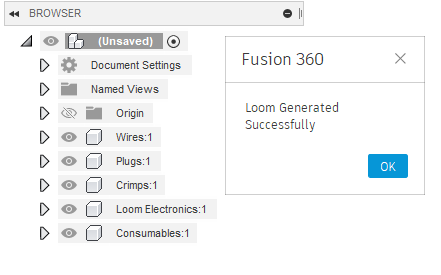
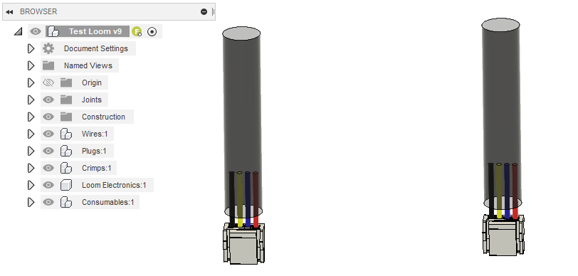
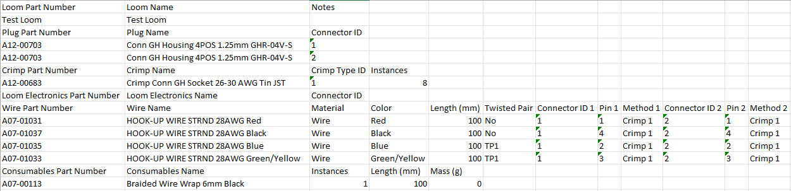

# ExtractBOM
A Fusion 360 Script for generating a Bill of Materials from an Assembly.
## Dependencies
The required dependencies for ExtractBOM are packaged in the folder. These are:
- tkinter for creating the save file dialog box.
- openpyxl for creating a excel spreadsheet.
- NUMPY required by openpyxl

### Assembly and Component formatting
To get the most out of this tool a specific format for assembly layouts and component naming is required. This is well documented in the Aeronavics CAD Standard Practices document currently stored on the Confluence wiki. Not following these standards will cause you a great deal of pain when it comes to using these tools.

### Currently Supported Component Types
Components and subassemblies can be tagged by placing a tag in brackets (e.g. "(machined)") at the end of the component name. Subassemblies can use the grp modifier in the tag (e.g. "(machined grp)")to signal that this a group of that type of component so all sub components will be tagged with that type. Tags are not case sensitive. These tags will all be stripped from the name in the BOM. The currently supported types are:
- fasteners
- printed
- machined
- hardware
- electronics
- subassemblies
- looms

## Basic Assembly Format and Rules
The basic rules for a Fusion 360 Assembly are as follows:
- Only internal components in the top level.
- Top level components are all component groups. e.g. Fasteners, Printed, Machined...
- Not all Component type Groups are necessary. If the assembly doesn't contain any of that type you don't need to add them.
- Having empty component groups is also fine.
- the generate assembly script can be used to generate the assembly tree quickly and correctly and is the recommended method when creating a new assembly.
- Additionally there is no specific ordering of the component type groups that is required.

## Wiring Looms
The Boom tool will also create a Bill of Materials (BOM) and an assembly guide for wiring looms if the loom component is created with a specific set of conditions. Running the "generateLoom" script in an empty external component is the easiest way to do the initial setup of a Loom as it creates all the component groups you need as well as setting up the templates for the configuration of the loom within the component group descriptions. For a component to be considered a loom it must be either tagged as a loom in the name or description via "(Looms)" or be nested in a Looms group or a group tagged with "(Looms Grp)". Sub-components in a loom are not tracked in either of the primary BOMs (structured and unstructured), instead the looms BOM should be used to get a BOM of each of the unique looms in the assembly.

There are 5 component groups in a loom:
- Wires (The wires to be used in the loom. The material of the component should be the sheath material and the color should be the color of the sheath)
- Plugs (The Plugs are the connectors that will plug into the headers on the components being connected to e.g a Molex Click-Mate Connector. These will likely come with a compatible crimp to be imported)
- Crimps (The Crimps are required by the Plugs and are to be added to the assembly for tracking on the BOM)
- Loom Electronics (This includes any electronics components required in the Loom, e.g. the 5ohm resistor in the soft start cable. These are also considered to be connectors as wires will be connected to them)
- Consumables (Various consumable items used to create the Loom, e.g. Heat-shrink, Glue, Cable Braid...)

To start the user should import all the required plugs, wire, crimps, electronics and consumable components that the loom requires and place them into the relevant groups. The user will then need to specify the configuration of the loom via the descriptions of the component groups. This is generally best done using notepad or a similar tool as the description box is very small in fusion. Each configuration is in the form of (XXXX:YYYY:ZZZZ) with each of the values separated by a : and each configuration is contained in brackets. There are different numbers of values depending on which group is being configured.

### Plug configuration: (Part Number:Connector ID)
There must be a configuration specified for each Plug in the loom.
- Part Number: the Part Number is the Odoo part number of the Plug.
- Connector ID: the unique connector ID of the Plug, each Plug even those of the same type must have a unique ID. This must also be unique to all loom electronics as well.

### Crimp configuration: (Part Number:Crimp Type ID:Instances)
There must be a configuration specified for each type of crimp in the loom, e.g. if you have JST GH crimps and Molex Click-mate Crimps you will need two configurations.
- Part Number: the Part Number is the Odoo part number of the Crimp.
- Crimp Type ID: A unique ID for the type of crimp in this loom.
- Instances: The number of this Crimp type in the loom.

### Loom Electronics Configuration: (Part Number:Connector ID)
There must be a configuration specified for each electronic component in the loom.
- Part Number: the Part Number is the Odoo part number of the Loom electronic component.
- Connector ID: the unique connector ID of the electronic component, each electronic component even those of the same type must have a unique ID. This must also be unique to all plugs as well.

### Consumables Configuration: (Part Number:Instances:Length:Mass)
There must be a configuration specified for each different Consumable in the loom. e.g. you can use the same configuration for two identical lengths and types of heat-shrink and just increment the instances value, alternatively if the heat-shink is different lengths you will need a separate configuration for each length. The length and mass of the component can be zero if it's not important for the particular consumable.
- Part Number: the Part Number is the Odoo part number of the Consumable.
- Instances: The number of this Consumable in the loom.
- Length: The Length of this Consumable in mm.
- Mass: The amount of mass of the consumable in grams.

### Wires Configuration: (Part Number:length:Twisted Pair:Connector ID 1:Pin 1:Method 1:Connector ID 2:Pin 2:Method 2)
This is the most complicated configuration as it links all the other components together. Each Wire configuration details the connection of 1 wire between two connectors. In the cad Model these connectors do not need to be physically connected and the wire is generally modeled as a short piece coming out of each connector.
Part Number: the Part Number is the Odoo part number of the Consumable.
length: The Length of this Wire in mm.
Twisted Pair: Whether this is a wire in a twisted pair. If the wire is a twisted pair label the wire with "TPx" where x is the twisted wire ID, eg if there is only one twisted pair in a loom two of the wires should be labeled "TP1". If the wire is not part of a twisted pair label the wire "-".
Connector ID 1: This is the unique ID of the first connector that the wire is connected to.
Pin 1: This is the pin on the first connector that the wire is connected to. For example on a jst that would be the pin number whereas for something like a diode that could be "+ve terminal". 
Method 1: This is how the wire is connected to the first connector. E.g. if the connector is a plug with a crimp the Method would be "Crimp x" where x is the Crimp Type ID. If it was a soldered connection you could specify "Solder".
Connector ID 2: Same as Connector ID 1 but for the second connector.
Pin 2: Same as Pin 1 but for the second pin.
Method 2: Same as Method 1 but for the second method.

### Example of Loom CAD Model and Outputs
This is an example model and the output from the BOM. Note a Loom BOM can be only be created if the loom is a part of a larger assembly.

The Notes Cell contains the description of the root component in the loom which can be used to give assembly instructions for the loom.