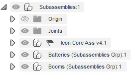
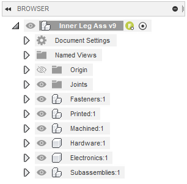

# ExtractBOM
A Fusion 360 Script for generating a Bill of Materials from an Assembly.
## Getting Started
### Dependencies
The required dependencies for ExtractBOM are packaged in the folder. These are:
- tkinter for creating the save file dialog box.
- openpyxl for creating a excel spreadsheet.
- NUMPY required by openpyxl

### Assembly and Component formating
To get the most out of this tool a specific format for assembly layouts and component naming is required. This is well documented in the Aeronavics CAD Standard Practices document currently stored on the Confluence wiki. Not following these standards will cause you a great deal of pain when it comes to using these tools.

#### Currently Supported Component Types
Components and subassemblies can be tagged by placing a tag in brackets (e.g. "(machined)") at the end of the component name. Subassemblies can use the grp modifyer in the tag (e.g. "(machined grp)")to signal that this a group of that type of component so all sub components will be tagged with that type. Tags are not case sensitive. These tags will all be stripped from the name in the BOM. The currently supported types are:
- fastener
- printed
- machined
- hardware
- electronics
- subassembly

#### Basic Assembly Format and Rules
The basic rules for a Fusion 360 Assembly are as follows:
- Only internal components in the top level.
- Top level components are all component groups. e.g. Fasteners, Printed, Machined...
- Not all Component type Groups are necessary. If the assembly doesn't contain any of that type you don't need to add them.
- Having empty component groups is also fine.
- the generate assembly script can be used to generate the assembly tree quickly and correctly and is the reccommeded method when creating a new assembly.
- Additionally there is no specific ordering of the component type groups that is required.

